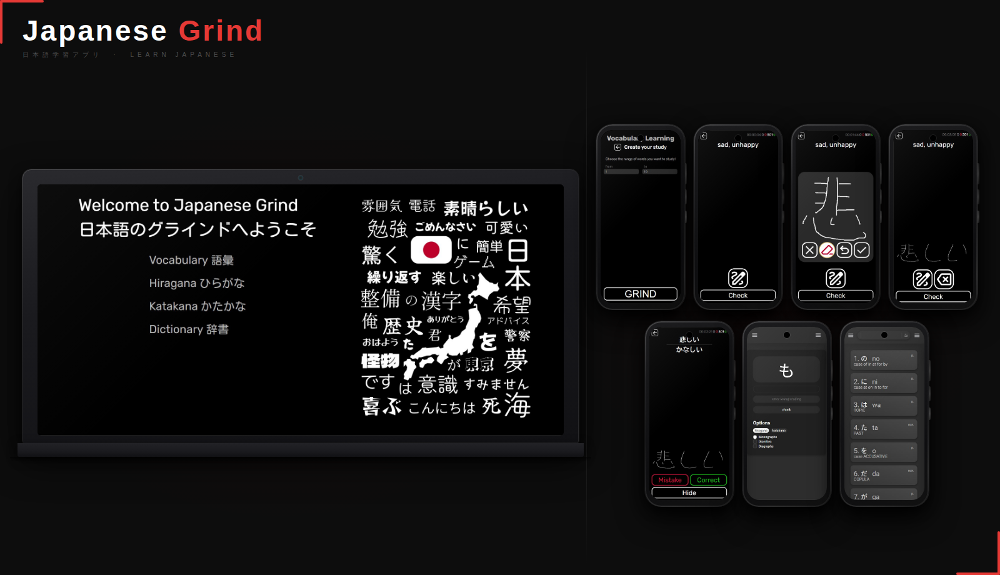

# JapanEasy

## About

JapanEasy is a web application designed to help users learn Japanese writing systems and vocabulary in a simple and structured way.

This project is part of a larger Japanese learning ecosystem that consists of two connected applications.

JapanEasy was originally the first version of the project, built with **Vite**, and focused on:

- Hiragana learning
- Katakana learning
- Japanese dictionary functionality

During development, I decided to migrate the main application to **Next.js**, which led to the creation of a new project called **Japanese Grind**.

JapanEasy was kept as a separate repository because it was already stable and fully functional. Both applications now work together as one ecosystem.

👉 Main application (Next.js version):  
https://github.com/ErNeRooo/japanese-grind

---

## Live Demo

👉 https://nihon-go-kaizen.web.app

---

## Tech Stack

- React
- Vite
- TypeScript
- Sass

---

## Features

### Kana Learning

- Hiragana learning module
- Katakana learning module
- Structured practice for memorization

### Japanese Dictionary

- Word lookup functionality
- Vocabulary browsing
- Fast and simple access to meanings

### Learning Experience

- Minimal and distraction-free interface
- Focused on repetition and memorization

## Purpose

The goal of JapanEasy is to provide a simple and efficient way to learn Japanese kana and explore vocabulary without unnecessary complexity.
